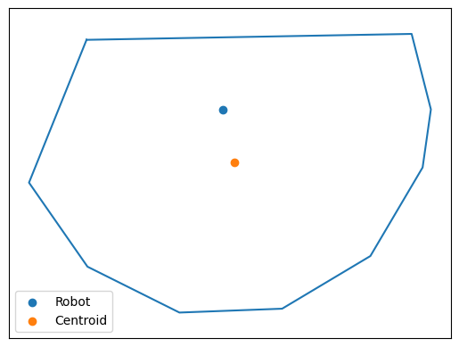

# pycoverage-limited

Coverage Control of a Multi-Robot System with limited sensing range.

## Dependencies
- numpy
- [Shapely](https://shapely.readthedocs.io/en/stable/manual.html)
- [SciPy](https://scipy.org/)

## Usage
### Limited Voronoi partitioning
Calculate the bounded Voronoi partitioning of the environment and limit each Voronoi cell to the sensing range of the robot.
Bounded Voronoi partitioning of the environment:

Limited Voronoi cell for the single robot:

### Range-Limited Coverage Control
Exploit the limited Voronoi partitioning for centralized control of a Multi-Robot system with limited sensing range.

- Unifrom probability distribution

- Gaussian probability distribution

